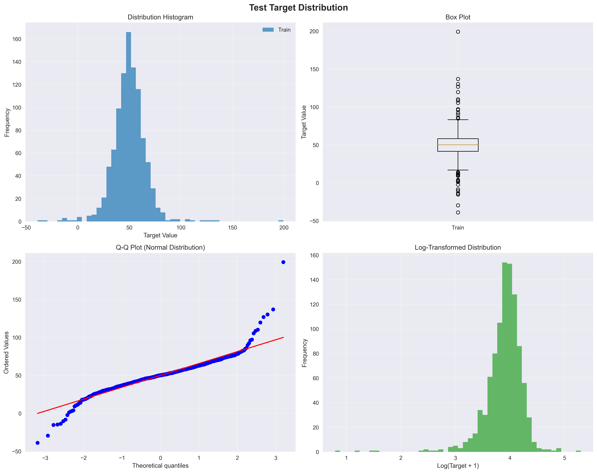
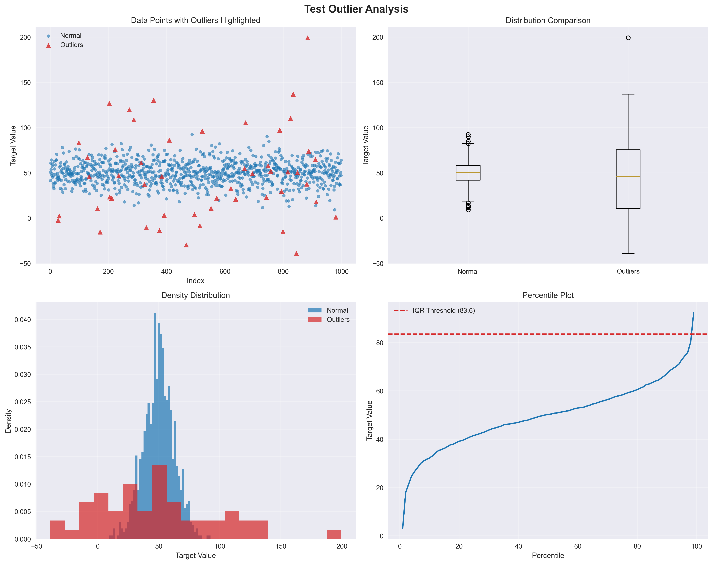
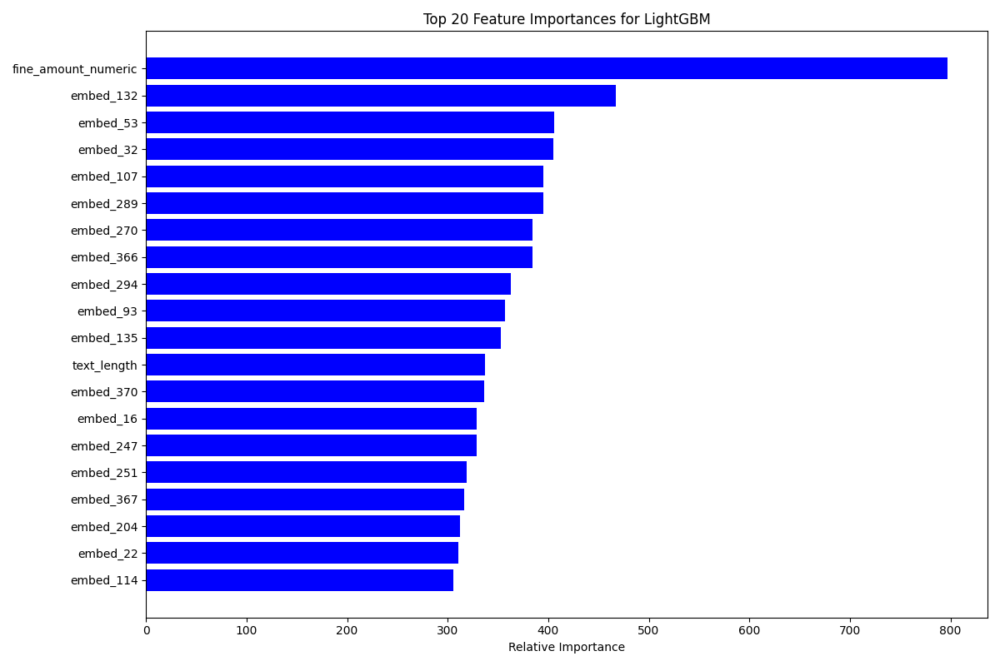
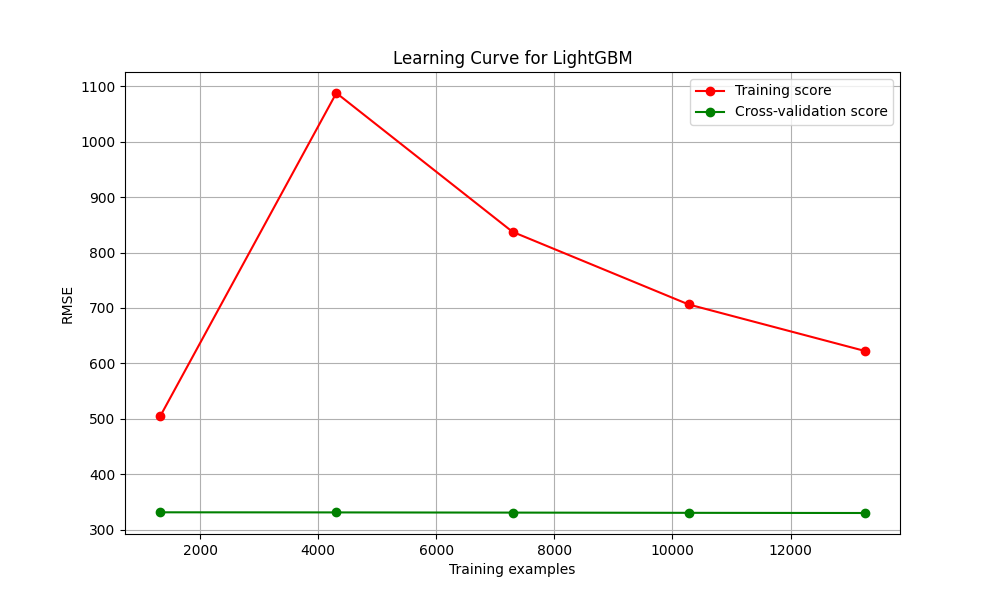
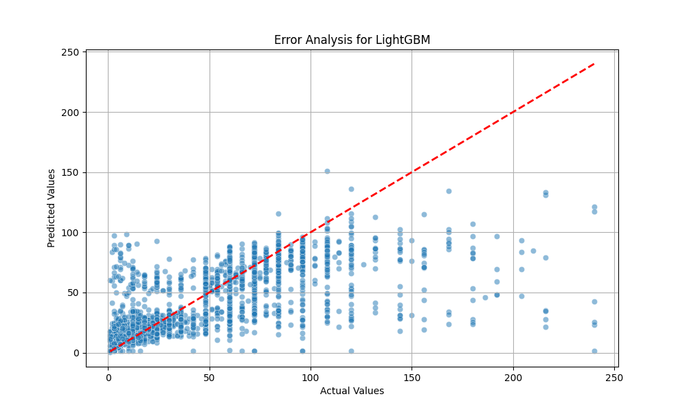

# 🏛️ Dataquest 4.0 — Court Sentence Duration Prediction

<p align="center">
  
</p>

<p align="center">
  
  
  
  
</p>

---

## 📋 Overview

**Objective Quest** adalah cabang lomba dari **DATAQUEST 4.0**, yang diselenggarakan oleh **Himpunan Mahasiswa Teknologi Sains Data, Fakultas Teknologi Maju dan Multidisiplin, Universitas Airlangga**. Kompetisi ini merupakan platform bagi peserta untuk mengembangkan kemampuan sebagai *data scientist*, mulai dari *business understanding*, *data preprocessing*, *modelling*, hingga *model evaluation*.

---

## 🎯 Problem Statement

### Latar Belakang

Sistem hukum Indonesia menganut **civil law**, dengan undang-undang tertulis sebagai acuan utama. Dalam praktiknya, yurisprudensi (putusan hakim sebelumnya) juga menjadi pertimbangan penting untuk menjaga konsistensi hukum.

Menurut data Mahkamah Agung, jumlah dokumen putusan di Indonesia bertambah hingga **~300.000 dokumen per 3 bulan** (≈ 100.000 dokumen/bulan). Volume yang masif ini menciptakan tantangan besar bagi praktisi hukum.

### Tugas

> **Membangun model Machine Learning** yang memprediksi **lama hukuman penjara (dalam bulan)** untuk kasus pidana, berdasarkan **narasi teks dokumen putusan pengadilan**.

---

## 🗂️ Dataset

| File | Deskripsi |
|------|-----------|
| `train.csv` | Data latih dengan label `lama hukuman (bulan)` |
| `test.csv` | Data uji tanpa label |
| `file_putusan/` | 23.675 dokumen putusan pengadilan (teks mentah) |
| `file_putusan_preprocessed/` | Dokumen setelah preprocessing |
| `preprocessed_extracted_features.csv` | Fitur hasil ekstraksi (v1) |
| `preprocessed_extracted_features2.csv` | Fitur hasil ekstraksi dengan NLP hybrid (v2) |

### Target Variable Statistics

| Metrik | Nilai |
|--------|-------|
| Count | 16,572 |
| Mean | 45.31 bulan |
| Median | 24.00 bulan |
| Std | 691.26 bulan |
| P99 | 180.00 bulan |

---

## ⚙️ Metodologi

### Pipeline

```
Raw Court Documents (TXT)
         │
         ▼
  [ ekstraksi_file_putusan.py ]
  ┌──────────────────────────────┐
  │  NLP Hybrid Backend:         │
  │  - SpaCy (id_core_news_sm)   │
  │  - Stanza (tokenize, NER)    │
  │  - Sastrawi (Stemmer)        │
  │  - Regex Patterns            │
  └──────────────────────────────┘
         │
         ▼
  Extracted Features CSV
  (cooperation, fine_amount, behavioral_impact, ...)
         │
         ▼
  [ sentence_prediction_model.py / advanced_nlp_processor.py ]
  ┌────────────────────────────────────────────────────────┐
  │  Feature Engineering:                                   │
  │  - Numeric: cooperation_score, fine_amount_log, ...    │
  │  - Text: TF-IDF + TruncatedSVD (100 dims)             │
  │    (atau SentenceTransformer embeddings)               │
  └────────────────────────────────────────────────────────┘
         │
         ▼
  [ Ensemble Models ]
  ┌──────────────────────────────────┐
  │  - XGBoost                       │
  │  - LightGBM                      │
  │  - Random Forest                 │
  │  - Gradient Boosting             │
  │  - CatBoost                      │
  │  - Stacking (RidgeCV meta)       │
  │  → Weighted Blending (LS non-neg)│
  │  → Isotonic Calibration          │
  └──────────────────────────────────┘
         │
         ▼
  submission.csv  (lama hukuman bulan)
```

### Fitur-Fitur Utama

| Fitur | Deskripsi |
|-------|-----------|
| `cooperation_score` | Skor kooperatif terdakwa (1=kooperatif, -1=tidak) |
| `fine_payment_score` | Status pembayaran denda |
| `behavioral_score` | Dampak perilaku (mitigating/aggravating) |
| `fine_amount_numeric` | Nilai denda (rupiah) |
| `fine_amount_log` | Log-transform nilai denda |
| `fine_subsidiary_flag` | Apakah ada klausul subsidair |
| `mitigating_count` | Jumlah faktor meringankan |
| `aggravating_count` | Jumlah faktor memberatkan |
| `sentence_adjustment` | Faktor penyesuaian hukuman berbasis reasoning |
| TF-IDF SVD (100d) | Embedding teks dari dokumen putusan |

---

## 📊 Visualisasi Hasil

### Distribusi Target & Analisis Outlier
<p align="center">
  
  <br><em>Distribusi lama hukuman (bulan) — sangat right-skewed, digunakan log-transform</em>
</p>

<p align="center">
  
  <br><em>Analisis outlier pada target variable</em>
</p>

### Feature Importance
<p align="center">
  
  <br><em>Top features yang paling berpengaruh terhadap prediksi hukuman</em>
</p>

### Learning Curve
<p align="center">
  
  <br><em>Learning curve model LightGBM — menunjukkan generalisasi model</em>
</p>

### Error Analysis
<p align="center">
  
  <br><em>Analisis error prediksi vs nilai aktual</em>
</p>

---

## 🏗️ Struktur Proyek

```
Dataquest 4.0/
├── 📓 Manut Ae_Dataquest.ipynb          # Main notebook
├── 🐍 ekstraksi_file_putusan.py         # NLP feature extraction engine
├── 🐍 sentence_prediction_model.py      # Main ensemble ML pipeline
├── 🐍 advanced_nlp_processor.py         # Advanced NLP (SentenceTransformer)
├── 🐍 model_visualizer.py               # Visualization utilities
├── 📊 train.csv                         # Training data
├── 📊 test.csv                          # Test data
├── 📊 preprocessed_extracted_features.csv   # Extracted features v1
├── 📊 preprocessed_extracted_features2.csv  # Extracted features v2
├── 📁 file_putusan/                     # Raw court documents (23,675 files)
├── 📁 file_putusan_preprocessed/        # Preprocessed court documents
├── 📁 model_data/                       # Saved model artifacts
├── 🖼️ target_distribution_analysis.png
├── 🖼️ outlier_analysis.png
├── 🖼️ feature_importance.png
├── 🖼️ learning_curve.png
├── 🖼️ error_analysis.png
├── 📄 submission.csv                    # Final predictions
└── 📄 Leaderboard Team.jpeg            # Team leaderboard screenshot
```

---

## 🚀 Cara Menjalankan

### 1. Install Dependencies

```bash
pip install pandas numpy scikit-learn xgboost lightgbm catboost torch sentence-transformers spacy stanza Sastrawi
```

### 2. Ekstraksi Fitur dari Dokumen Putusan

```bash
python ekstraksi_file_putusan.py
```

Script ini akan:
- Membaca semua dokumen TXT dari `file_putusan/`
- Mengekstrak fitur: status kooperatif, jumlah denda, faktor meringankan/memberatkan
- Menggunakan NLP hybrid (SpaCy + Stanza + Regex)
- Menyimpan hasil ke `preprocessed_extracted_features2.csv`

### 3. Melatih Model dan Generate Prediksi

```bash
python sentence_prediction_model.py
```

Script ini akan:
- Load data dan fitur yang diekstraksi
- Melakukan feature engineering
- Melatih ensemble (XGBoost, LightGBM, RF, GBM, CatBoost, Stacking)
- Membuat prediksi dan menyimpan ke `submission.csv`

### 4. Alternatif: Advanced NLP Pipeline (SentenceTransformer)

```bash
python advanced_nlp_processor.py
```

---

## 🛠️ Tech Stack

| Kategori | Library |
|----------|---------|
| **Machine Learning** | XGBoost, LightGBM, CatBoost, scikit-learn |
| **Deep Learning** | PyTorch, SentenceTransformers |
| **NLP** | SpaCy, Stanza, Sastrawi, TF-IDF |
| **Data Processing** | Pandas, NumPy |
| **Visualization** | Matplotlib, Seaborn |

---

## 👥 Tim

> Peserta Kompetisi Dataquest 4.0 — Objective Quest Track

---

## 📌 Catatan

- Semua dokumen putusan pengadilan menggunakan Bahasa Indonesia
- Target variabel sangat right-skewed → digunakan **log-transform** saat training
- Model terbaik menggunakan **inverse-RMSE weighted blending** + **Isotonic Calibration**
- GPU (CUDA) digunakan jika tersedia untuk mempercepat training

---

<p align="center">
  <em>Dataquest 4.0 · Universitas Airlangga · HMTSD FTMM</em>
</p>
